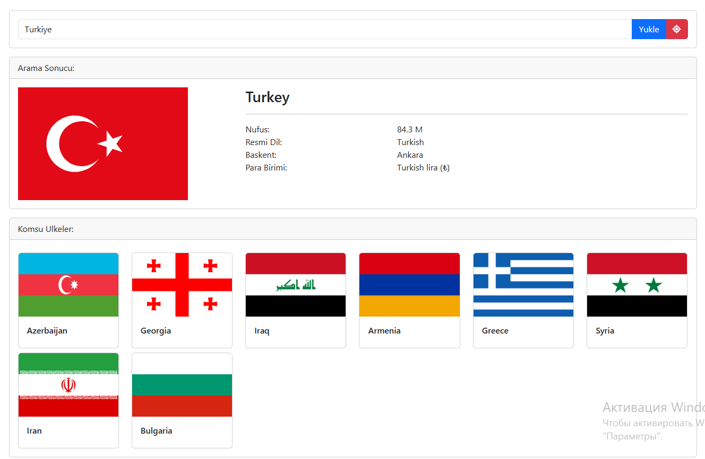

# 🌍 Country Info Finder (Ülke Bilgi Uygulaması)

Bu proje, kullanıcıların bir ülkenin bilgilerini (nüfus, dil, başkent, para birimi) görüntüleyebileceği ve komşu ülkeleri görebileceği bir web uygulamasıdır. Ayrıca tarayıcı konum bilgisi ile otomatik olarak bulunduğun ülkenin bilgilerini de getirir.

## 🚀 Özellikler

- Ülke adına göre bilgi arama
- Kullanıcının bulunduğu konuma göre ülke tespiti
- Ülke bayrağı, nüfus, resmi dil, başkent, para birimi bilgisi
- Komşu ülkelerin listesi ve bayrakları

## 🧰 Kullanılan Teknolojiler

- HTML5
- CSS (Bootstrap 5)
- JavaScript

## 🖼️ Ekran Görüntüsü

🔗 **Canlı Demo:**  
👉 [Siteyi Görüntüle](https://682b32ffc0bb011a5377e064--lovely-klepon-1884b0.netlify.app/)
